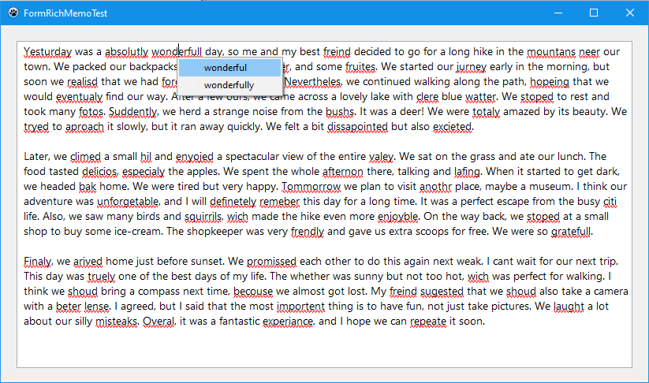

# Integrating Spell Checking with RichKit

For a simplified integration, you can use the non‑visual `TSpellChecker` component from the [DesignKit](https://github.com/plainlib/designkit) package. It provides a ready-to-use drop-in solution that handles the spell checker lifecycle and event wiring, so you can focus on your application logic.

  

## Requirements

- **Lazarus** (tested with 4.8) / **Free Pascal Compiler** 3.2.2 or newer.
- **LCLBase** – included with Lazarus.
- **[RichMemoPackage](https://github.com/plainlib/richmemo)** – extended `TRichMemo` component with clipboard and undo helpers (available in the [plainlib](https://github.com/plainlib) repository).
- **[Helpers](https://github.com/plainlib/helpers)** – common utility units used by the spell‑checker (also available in plainlib).
- **Windows 8 or later** is required only for the native `WinSpellChecker` backend. The **HunSpell** backend works on all platforms (Windows, Linux, macOS) and does not need any OS‑specific API.
- Optionally, you can use the non‑visual **[TSpellChecker](https://github.com/plainlib/designkit)** component from [DesignKit](https://github.com/plainlib/designkit) for an even simpler drop‑in integration.

This guide explains how to add spell checking to your Delphi/Lazarus application using the **RichKit** package modules (`RichSpellChecker`, `SpellUtils`). Two backends are supported:

- **Windows Spell Checker** (native, Windows 8+) – uses the OS spell‑check API, supports multiple languages, and provides comprehensive spelling/grammar checks.
- **HunSpell** (cross‑platform) – a pure Object Pascal implementation of the Hunspell engine. Works on Windows, Linux, and macOS. Requires Hunspell dictionary files (`.aff` + `.dic`).

Both backends share the same `TRichSpellChecker` interface for underlining errors and displaying suggestion menus.

## Using Windows Spell Checker (Native)

### Dependencies

- Windows operating system (Windows 8 or later recommended)
- Lazarus / Delphi with support for COM interfaces
- Units:
  - `RichSpellChecker`
  - `SpellUtils`
  - `WinSpellChecker`
  - `RichMemo` (or `TRichMemo` component)

### Setup

1. **Add the units to your form’s `uses` clause.**

```pascal
uses
  RichSpellChecker, SpellUtils, WinSpellChecker, RichMemo;
```

2. **Declare a field for the spell checker.**

```pascal
type
  TYourForm = class(TForm)
    Memo: TRichMemo;
    // ...
  private
    FSpellChecker: TRichSpellChecker;
  end;
```

3. **Create and initialize the spell checker in `FormCreate`.**

```pascal
procedure TYourForm.FormCreate(Sender: TObject);
begin
  FSpellChecker := TRichSpellChecker.Create(Memo);
  FSpellChecker.OnSpellCheckNeeded := @DoSpellCheck; // optional
end;
```

4. **Destroy the checker in `FormDestroy`.**

```pascal
procedure TYourForm.FormDestroy(Sender: TObject);
begin
  FSpellChecker.Free;
end;
```

### Performing a Spell Check

#### Synchronous Check (Blocking)

```pascal
procedure TYourForm.CheckSpellingNow;
var
  Lang: string;
begin
  Lang := 'en-US'; // or any BCP-47 tag, e.g., 'ru-RU'
  // This directly applies underlines to the memo.
  TSpell.WinCheck(Memo, FSpellChecker, Lang, [scoSpelling], True);
end;
```

#### Asynchronous Check (Non-blocking)

For better UI responsiveness, run the check in a background thread. Use `TSpell.CheckText` to obtain error data without touching the GUI, then apply it via `TSpell.ApplyErrors` in the main thread.

Example using a simple `TTimer` for debouncing:

```pascal
procedure TYourForm.MemoChange(Sender: TObject);
begin
  // Reset timer on each keypress
  SpellTimer.Enabled := False;
  SpellTimer.Interval := 1000; // 1 second delay after typing stops
  SpellTimer.Enabled := True;
end;

procedure TYourForm.SpellTimerTimer(Sender: TObject);
begin
  SpellTimer.Enabled := False;
  // Run check asynchronously (pseudocode – use TThread or RunAsync)
  // Here we use a simple approach: run in a separate thread manually.
  TThread.CreateAnonymousThread(
    procedure
    var
      Errors: TSpellErrorArray;
    begin
      Errors := TSpell.CheckText(Memo.Text, 'en-US', [scoSpelling], True);
      TThread.Queue(nil,
        procedure
        begin
          TSpell.ApplyErrors(FSpellChecker, Errors);
        end
      );
    end
  ).Start;
end;
```

### Showing Context Menu (Suggestions)

Intercept the `OnContextPopup` event of the `TRichMemo`:

```pascal
procedure TYourForm.MemoContextPopup(Sender: TObject; MousePos: TPoint; var Handled: Boolean);
var
  P: TPoint;
begin
  P := Memo.ClientToScreen(MousePos);
  // Show the spell checker's context menu if the mouse is over a misspelled word.
  if FSpellChecker.ShowContextMenu(P.X, P.Y) then
    Handled := True;
end;
```

The method returns `True` if a menu was shown; otherwise, you may show your own context menu.

### Clearing Underlines

To clear all spell underlines manually:

```pascal
FSpellChecker.Clear;
```

### Important Notes

- **Language Support**: Not all languages are installed by default. Use `TSpell.WinSupportedLanguages` to get a list of available BCP-47 tags.
- **Undo/Redo**: The `TRichSpellChecker` uses `SuspendUndo`/`ResumeUndo` (Windows-specific) to prevent formatting changes from being recorded in the undo history. Make sure your `TRichMemo` helper provides these methods.
- **Performance**: For long texts, consider limiting the check to visible text or using a debounce timer as shown above.
- **Comprehensive Spelling**: Pass `[scoSpelling, scoComprehensiveSpelling]` to include grammar/style checks (available in some Windows versions).

---

## Using HunSpell for Cross-Platform Spell Checking

The `HunSpellChecker` unit provides a pure Object Pascal implementation of the Hunspell spell‑checking engine. Unlike the Windows Spell Checker, it works on all platforms (Windows, Linux, macOS) and does not rely on OS‑specific APIs. It requires Hunspell dictionary files (`.aff` and `.dic`) which can be obtained from various sources (e.g., OpenOffice, LibreOffice, or directly from Hunspell projects).

### Dependencies

- No special OS requirements – works on Windows, Linux, macOS.
- Units:
  - `HunSpellChecker`
  - `RichSpellChecker`
  - `SpellUtils`
  - `RichMemo` (or `TRichMemo` component)
- Hunspell dictionary files (`.aff` and `.dic`) for the desired language(s). You can obtain them from:
  - [LibreOffice dictionaries](https://github.com/LibreOffice/dictionaries)
  - [Hunspell project](https://github.com/hunspell/hunspell/tree/master/tests)
  - Various open-source repositories

### Main Features

- Load dictionaries from streams or files.
- Check words, entire texts, and get suggestions.
- Supports affix rules (prefixes, suffixes), compounding, break patterns, and REP/MAP tables.
- Works with UTF‑8 strings.
- Integrated with `TRichSpellChecker` via `TSpell.HunCheck` (same interface as the Windows checker).

### Basic Usage

```pascal
uses
  HunSpellChecker, RichSpellChecker, SpellUtils;

var
  HunChecker: THunSpellChecker;
  RichChecker: TRichSpellChecker;
begin
  HunChecker := THunSpellChecker.Create;
  try
    // Load dictionary files
    if HunChecker.LoadFromFiles('en_US.aff', 'en_US.dic') then
    begin
      // Check a single word
      if HunChecker.CheckWord('example') then
        ShowMessage('Correct')
      else
        ShowMessage('Misspelled');

      // Get suggestions
      var Suggestions := HunChecker.Suggest('exmple');
      // Suggestions is an array of strings

      // Integrate with RichMemo
      RichChecker := TRichSpellChecker.Create(RichMemo1);
      TSpell.HunCheck(RichMemo1, RichChecker, HunChecker, [scoSpelling], True);
    end;
  finally
    HunChecker.Free;
  end;
end;
```

### Loading from Streams

You can also load dictionaries from in‑memory streams (e.g., from resources):

```pascal
var
  AFFStream, DICStream: TStream;
begin
  AFFStream := TResourceStream.Create(HInstance, 'EN_US_AFF', RT_RCDATA);
  DICStream := TResourceStream.Create(HInstance, 'EN_US_DIC', RT_RCDATA);
  try
    HunChecker.LoadFromStream(AFFStream, DICStream);
  finally
    AFFStream.Free;
    DICStream.Free;
  end;
end;
```

### Automatic Dictionary Discovery

The helper function `HunspellDictionaryCandidates` returns an ordered list of possible dictionary names (without extension) for a given BCP‑47 language code. This can be used to search for dictionary files in a directory:

```pascal
var
  Candidates: TStringArray;
  Lang: string;
  i: Integer;
begin
  Lang := 'en-GB';
  Candidates := HunspellDictionaryCandidates(Lang);
  // Candidates might be ['en_GB', 'en_GB-oed', 'en', ...]
  for i := 0 to High(Candidates) do
    if FileExists('dicts\' + Candidates[i] + '.dic') then
    begin
      HunChecker.LoadFromFiles('dicts\' + Candidates[i] + '.aff',
                               'dicts\' + Candidates[i] + '.dic');
      Break;
    end;
end;
```

### Integration with TRichSpellChecker

Use `TSpell.HunCheck` just like `TSpell.WinCheck` – it fills the `TRichSpellChecker` with underlined errors and suggestions. The only difference is that you pass a `THunSpellChecker` instance instead of a language tag.

```pascal
procedure TForm1.DoSpellCheck;
begin
  // Same as WinCheck but with HunChecker
  TSpell.HunCheck(RichMemo1, FSpellChecker, FHunChecker, [scoSpelling], True);
end;
```

### Notes

- Hunspell dictionaries are typically named like `en_US.aff`/`en_US.dic` or `en_GB.aff`/`en_GB.dic`. The function `HunspellDictionaryCandidates` helps to locate the most appropriate variant.
- The checker supports most Hunspell features including affix flags, compound words, BREAK rules, REP and MAP tables, and ICONV conversions.
- Performance is suitable for real‑time checking; for very large texts, consider using a background thread (see `OneShotThread`).

---

# Working with HTML and RTF via Clipboard

The **RichKit** package provides full support for pasting and copying HTML/RTF content through the system clipboard. This is especially useful when you want to preserve formatting from web pages or other rich text sources.

The following units are involved:

- `ClipToHtml` – registers clipboard formats (`text/html`, `HTML Format`, `public.html`) and retrieves HTML data from the clipboard.
- `HtmlToRtf` – converts HTML strings to RTF, supporting common tags (bold, italic, underline, strike, lists, tables, font size/face, etc.).
- `RtfToHtml` – converts RTF back to HTML for copying formatted content.
- `RichMemoHelper` – extends `TRichMemo` with methods:
  - `PasteFromClipboardEx(AUseHtmlFormat: Boolean = True): Boolean` – pastes HTML from the clipboard as RTF (or plain text if `AUseHtmlFormat=False`). Returns `True` if successful.
  - `CopyToClipboardEx: Boolean` – copies the selected text to the clipboard in plain text, RTF, and HTML formats simultaneously.
  - `CutToClipboardEx: Boolean` – cuts the selection using the extended copy and removes the text.

## Integration Steps

1. **Add the required units** to your form’s `uses` clause:

```pascal
uses
  ClipToHtml, HtmlToRtf, RtfToHtml, RichMemoHelper;
```

2. **Ensure the clipboard formats are registered** (usually done automatically by `ClipToHtml` when you call `GetHtmlFromClipboard` or `EnsureHtmlFormatRegistered`; for RTF, call `EnsureRtfFormatRegistered`).

3. **Override keyboard shortcuts** (Ctrl+C, Ctrl+V, Ctrl+X) in the `OnKeyDown` event of your `TRichMemo` to use the extended methods. Example from `mainform.pas`:

```pascal
procedure TFormRichMemoTest.RichMemoKeyDown(Sender: TObject; var Key: word; Shift: TShiftState);
var
  CopyShortcut, CutShortcut, PasteShortcut: Boolean;
begin
  CopyShortcut := ((Shift = [ssCtrl]) and (Key = VK_C)) or
                  ((Shift = [ssCtrl]) and (Key = VK_INSERT));
  CutShortcut  := ((Shift = [ssCtrl]) and (Key = VK_X)) or
                  ((Shift = [ssShift]) and (Key = VK_DELETE));
  PasteShortcut := ((Shift = [ssCtrl]) and (Key = VK_V)) or
                   ((Shift = [ssShift]) and (Key = VK_INSERT));

  if CopyShortcut then
  begin
    if RichMemo.CopyToClipboardEx then
      Key := 0; // block standard copy
  end
  else if CutShortcut then
  begin
    if RichMemo.CutToClipboardEx then
      Key := 0;
  end
  else if PasteShortcut then
  begin
    if RichMemo.PasteFromClipboardEx then
      Key := 0;
  end;
end;
```

4. **Context menu integration** (optional): you can also call `PasteFromClipboardEx` from a popup menu item to provide "Paste as HTML" functionality.

## Manual Conversion Functions

If you need to convert HTML/RTF manually, use these functions:

- `ConvertHtmlToRtf(const Html: string; DefaultFontSizePt: integer; AsFragment: Boolean = False; UseInlineFormatting: Boolean = False): string;`
  - Converts an HTML string to RTF. The `AsFragment` parameter returns only the RTF body without the header; `UseInlineFormatting` controls whether formatting uses control words (e.g., `\b`) instead of groups.
- `ConvertRtfToHtml(const Rtf: string): string;` – converts RTF to a clean HTML string.

Example:
```pascal
var
  RtfText, HtmlText: string;
begin
  HtmlText := GetHtmlFromClipboard; // from ClipToHtml
  if HtmlText <> '' then
  begin
    RtfText := ConvertHtmlToRtf(HtmlText, 12); // 12pt default
    // Insert RtfText into your RichMemo using InsertRtfAtCursor or direct assignment
  end;
end;
```

## Important Notes

- **HTML support** is limited to the most common tags (font styling, lists, basic tables). More complex CSS or JavaScript will be ignored.
- The conversion uses the current system DPI for pixel/twips calculations.
- When pasting, the method automatically detects if the clipboard contains HTML; if not, it falls back to plain text.
- For **copying**, the extended method enriches the clipboard with both RTF and HTML formats, ensuring maximum compatibility with other applications (e.g., Word, browsers).
- All operations are thread-safe and preserve the undo history of the RichMemo (formatting changes are recorded as normal user actions).

With these tools, your application can seamlessly exchange formatted text with other programs, providing a rich editing experience.